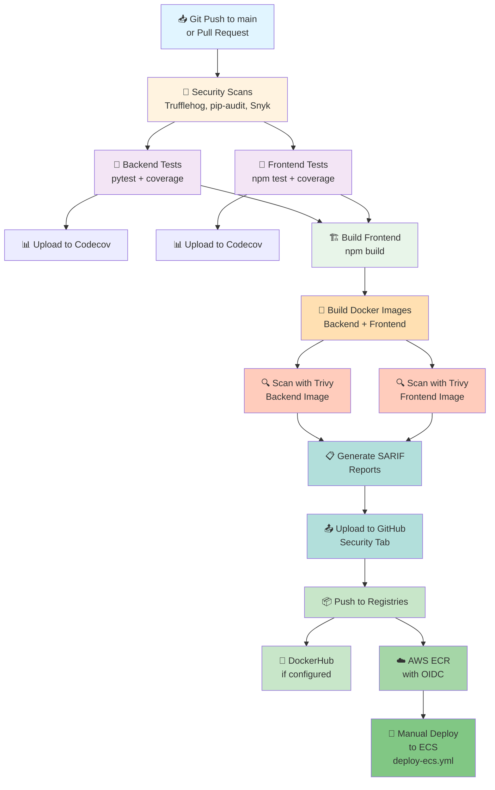

## Pipeline Status Indicators

| Stage | Status | Time | Retry |
|-------|--------|------|-------|
| Security | ⚠️ Non-blocking | ~2 min | Auto on failure |
| Testing | ❌ Blocks on failure | ~3 min | Manual retry |
| Build | ❌ Blocks on failure | ~4 min | Manual retry |
| Scan | ⚠️ Informational | ~3 min | Auto on failure |
| Push | ❌ Only if main branch | ~2 min | Manual retry |
| Deploy | 🟡 Manual trigger | ~5 min | Manual trigger |

---

## Job Dependencies

```
┌─────────────┐
│  security   │ (always runs)
└──────┬──────┘
       │
       ├──────────────────────┬──────────────────────┐
       ▼                      ▼                      ▼
   ┌────────────┐      ┌────────────┐      ┌──────────────┐
   │test-backend│      │test-frontend     │build-frontend│
   └─────┬──────┘      └────┬──────┘      └────┬─────────┘
         │                  │                   │
         └──────────────────┼───────────────────┘
                            ▼
                      ┌─────────────┐
                      │build-images │
                      └──────┬──────┘
                             ▼
                      ┌──────────────┐
                      │scan-images   │
                      └──────┬───────┘
                             ▼
                      ┌──────────────┐
                      │ push-ecr     │
                      │(if main)     │
                      └──────┬───────┘
                             ▼
                      ┌──────────────┐
                      │deploy-ecs    │
                      │(manual)      │
                      └──────────────┘
```

---

## Execution Timeline (Typical Run)

```
0:00s   → 🟢 Workflow starts
0:15s   → Security scans begin (parallel)
2:00s   → ✅ Security scans complete
2:05s   → Backend & Frontend tests start (parallel)
2:10s   → Frontend build starts
5:00s   → ✅ All tests & build complete
5:10s   → Docker images building
7:00s   → Images built, Trivy scanning starts
9:00s   → ✅ Container scan complete
9:05s   → Image upload to ECR starts
10:30s  → ✅ Images pushed to ECR
10:31s  → 🟡 Awaiting manual deployment trigger

Manual trigger:
0:00s   → Deploy job starts
0:30s   → Update task definition
1:00s   → Update ECS service
5:00s   → ✅ Service stable, deployment complete
```

